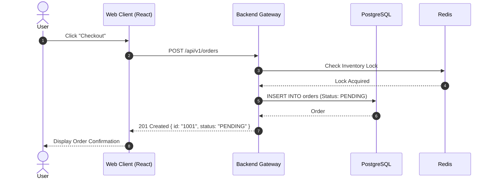

# Technical Documentation & Knowledge Management Standards

This skill defines the templates and workflows for creating clear, professional, and maintainable technical documentation.

---

## 1. Professional README.md Structure

A production-grade `README.md` must contain:

1. **Header & Badges**: Project name, tagline, CI/CD status, release version, license.
2. **Key Features**: Bulleted list of unique capabilities and advantages.
3. **Prerequisites & System Requirements**: Supported OS, runtime versions (e.g. Node 20+, Python 3.12+), external dependencies.
4. **Quickstart / Installation**: Step-by-step setup commands (copy-paste ready).
5. **Configuration (.env)**: Table of required and optional environment variables with descriptions.
6. **Architecture Overview & Project Layout**: Directory map and high-level data flow.
7. **Testing & Quality Assurance**: Commands for running unit, integration, and linter checks.
8. **Contributing & License**: Links to `CONTRIBUTING.md` and `LICENSE`.

---

## 2. Architecture Decision Records (ADRs)

Use the industry-standard **Nygard ADR Format** for major design and architectural decisions:

```markdown
# ADR-001: [Title - e.g., Adopt Redis for Distributed Session Caching]

## Status
[Proposed | Accepted | Superseded by ADR-002 | Deprecated]

## Context
Describe the current architectural state, business requirements, and the problem or limitation being addressed.

## Decision
State the exact architectural choice being made, libraries selected, and design pattern adopted.

## Consequences
### Positive:
- Improved read latency from 45ms to 3ms.
- Decoupled session storage from app server memory.

### Negative / Trade-offs:
- Additional infrastructure component to monitor and maintain.
- Requires network timeout fallback handling.
```

---

## 3. Mermaid System Architecture & Sequence Diagrams

Use Mermaid diagrams to make complex flows readable:

### Sequence Diagram Example:


---

## 4. API Reference Documentation Standards

For every endpoint, document:
- **HTTP Method & URL**: `POST /api/v1/users`
- **Authentication**: `Bearer <JWT>` (Required / Optional / Public)
- **Headers**: `Content-Type: application/json`, `X-Request-Id: <uuid>`
- **Request Body Parameters**: Table with Field, Type, Required/Optional, Validation Constraints, Description.
- **Response Examples**: Complete 200/201 Success envelope and 400/401/404/500 Error envelopes.

---

## 5. CHANGELOG.md (Keep a Changelog Standard)

Categorize changes under Semantic Versioning headers (`[v1.2.0] - 2026-09-02`):
- **Added**: for new features.
- **Changed**: for changes in existing functionality.
- **Deprecated**: for soon-to-be removed features.
- **Removed**: for now removed features.
- **Fixed**: for any bug fixes.
- **Security**: in case of vulnerabilities.
